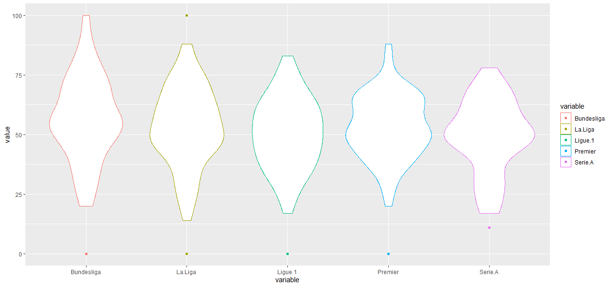
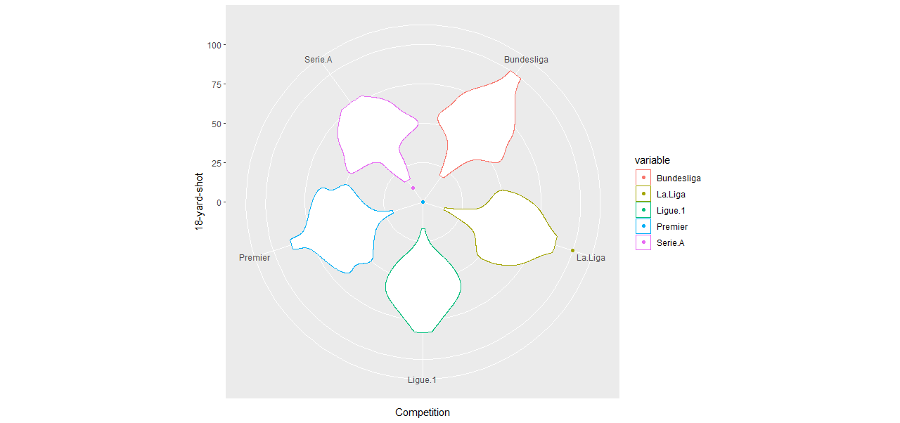
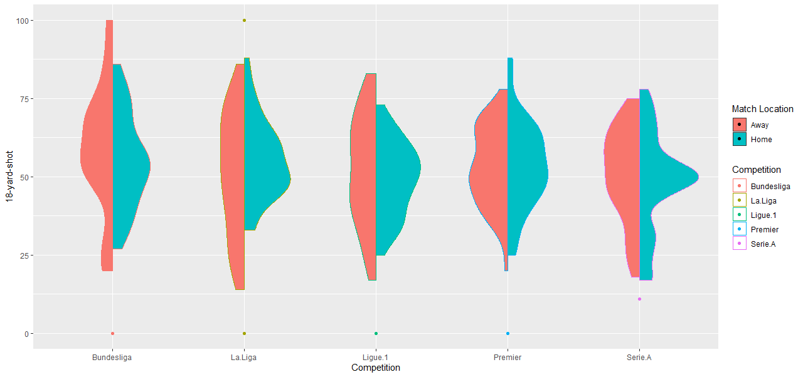
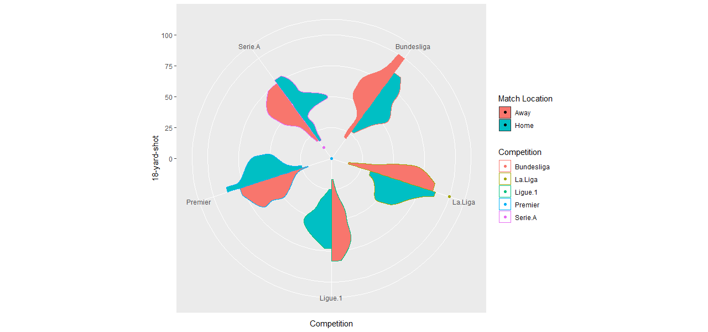

<!-- README.md is generated from README.Rmd. Please edit that file -->

# Article published in International Journal of Sports Science & Coaching

Originally, this is the repository for the article: _"Violinboxplot and enhanced radar plot as components of effective graphical dashboards: An educational example of sports analytics"_ that is published in the journal [International Journal of Sports Science & Coaching]. You can check [here](https://journals.sagepub.com/doi/full/10.1177/17479541221099638). 

# enhancedviolinboxplot

The primary developers are Pepus Daunis-i-Estadella and Martí Casals.

[](https://www.tidyverse.org/lifecycle/#experimental)

This function allows you to obtain violinboxplots and enhanced radar plot to represent the data pattern in parallel coordinates and also in polar coordinates, taking into account the statistical summaries as well as their distribution, without neglecting the interesting atypical data in the form of radar plots.

## Initialitzation

### Dependencies: ggplot2

Load Package: 

```{r}
if (!require('ggplot2')) install.packages('ggplot2'); library('ggplot2')
```

## Example of soccer with wide datasets

The example data set is soccer data of the top 13 European clubs in the 2016/17 season of most importat leagues (Premier League, La Liga, Ligue 1, Bundesliga, and Serie A). The variables used in this example are “competition” and “18-yard shot” that it was obtained from the publicly accessible website www.whoscored.com owned by Opta Sports.  
We use the example of soccer that is described in our article. The same function can be used for the basketball example. The example of soccer can be also applied with long format with the function that is available.

```{r}
load ("Data/soccer_wide_format.RData")
source("Scripts/function_wide_format_enhancedviolinboxplot.r")
```

```{r}
enhancedviolinboxplot(soccer, c(1,2,3,4,5), polar=F)
```
<!-- -->

```{r}
enhancedviolinboxplot(soccer, c(1,2,3,4,5), polar=T)+ xlab('Competition')+ ylab('18-yard-shot')
```
<!-- -->

```{r}
enhancedviolinboxplot(soccer, c(1,2,3,4,5), polar=F, dicotom=6)+ labs(fill="Match Location")+ labs(color="Competition")+ xlab('Competition')+ ylab('18-yard-shot')
```
<!-- -->


```{r}
enhancedviolinboxplot(soccer, c(1,2,3,4,5), polar=T, dicotom=6)+ labs(fill="Match Location")+ labs(color="Competition")+ xlab('Competition')+ ylab('18-yard-shot')
```
<!-- -->


## Example of soccer with long datasets

Imagine we have soccer datasets with long format. We can apply for instance the last figure as following:


```{r}
load ("Data/soccer_long_format.RData")
source("Scripts/function_long_format_enhancedviolinboxplot.r")
colnames(soccer2)[1]="18-yard-shoot"
```

```{r}
enhancedviolinboxplotlong(soccer2, c(1,2), polar=T, dicotom=3)+ labs(fill="Match Location")+ labs(color="Competition")+ xlab('Competition')+ ylab('18-yard-shot')
```
<!-- -->


